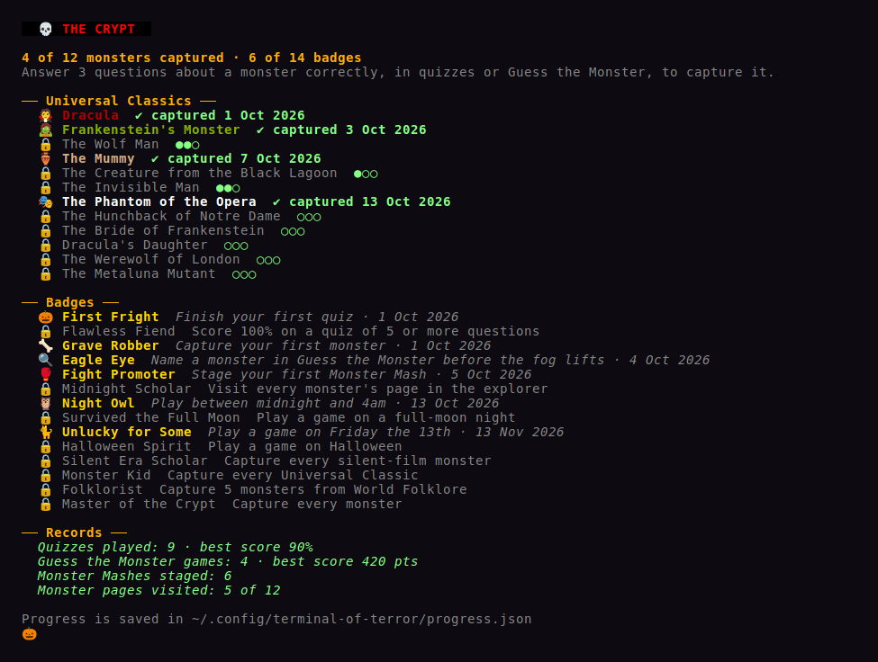
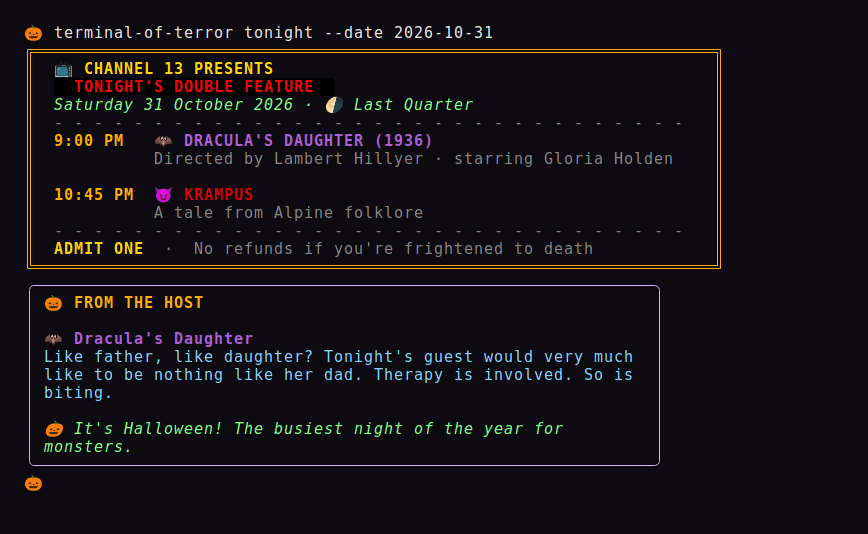
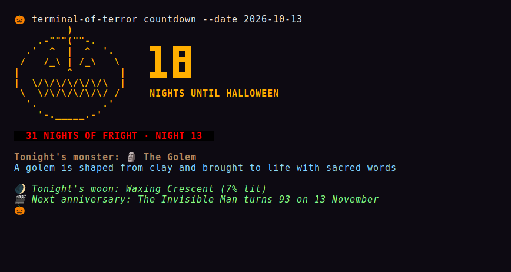
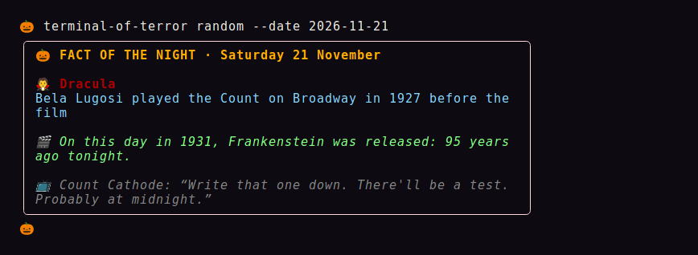
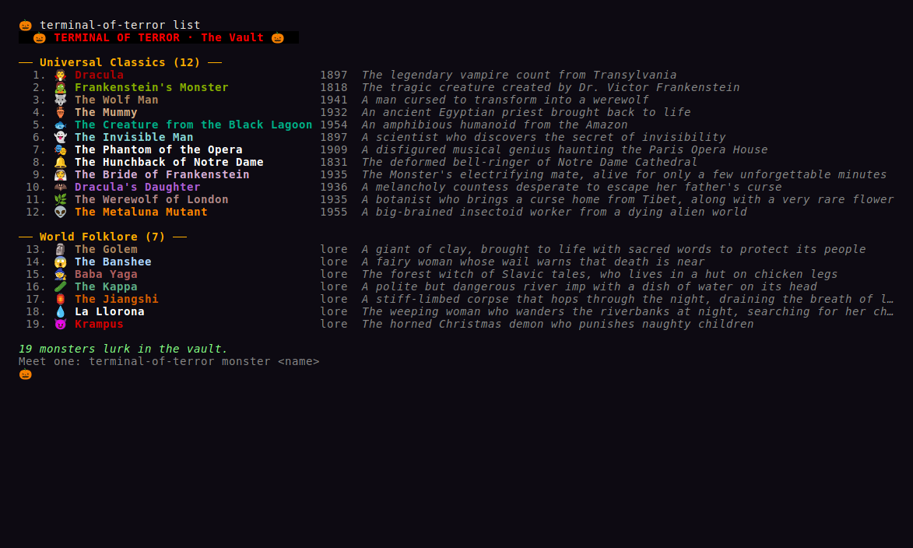

<div align="center">

```
▀█▀ █▀▀ █▀█ █▀▄▀█ █ █▄ █ ▄▀█ █     █▀█ █▀▀   ▀█▀ █▀▀ █▀█ █▀█ █▀█ █▀█
 █  ██▄ █▀▄ █ ▀ █ █ █ ▀█ █▀█ █▄▄   █▄█ █▀     █  ██▄ █▀▄ █▀▄ █▄█ █▀▄
```

### 📺 Channel 13's Creature Feature, live in your terminal

[](https://github.com/hungovercoders/terminal-of-terror/releases/latest)
[](https://github.com/hungovercoders/terminal-of-terror/actions/workflows/ci.yml)
[](go.mod)
[](LICENSE)


</div>

> 📺 *"Good evening, creatures of the night, and welcome to the Channel 13 Creature Feature. I'm your host, Count Cathode, broadcasting from beyond the static."*

**Terminal of Terror** brings the classic Universal monsters and creatures from world folklore to your terminal. Meet 19 monsters, learn the real history behind them (who played them, who did the makeup, and which "facts" Hollywood simply made up), then prove what you know in the Midnight Quiz and fill your crypt.

> [!WARNING]
> **Viewer discretion is advised.** Side effects may include knowing far too much about 1930s makeup artists, a sudden distrust of huts with chicken legs, and correcting your friends about silver bullets.

## 📅 Tonight's Programme

| Time | Feature |
|------|---------|
| 9:00 PM | [🔮 Summon it](#-summon-it): download or install |
| 9:05 PM | [🌙 Your first night](#-your-first-night): five commands to try |
| 9:15 PM | [🧛 The Creature Feature](#-the-creature-feature): the interactive explorer |
| 10:00 PM | [🧠 Games](#-games): the Midnight Quiz, Guess the Monster and the Monster Mash |
| 10:45 PM | [💀 The Crypt](#-the-crypt): capture monsters, earn badges |
| 11:30 PM | [🕛 Nightly rituals](#-nightly-rituals): fact of the night, double features, the Halloween countdown |
| Midnight | [📜 The roster](#-the-roster): every monster in the vault |
| 1:00 AM | [📦 Packs](#-monster-packs): make your own monsters |
| 3:00 AM | [📖 Command reference](#-command-reference), for the insomniacs |
| Dawn | [📚 Night School](#-night-school): build it yourself, in 31 nights |

## 🔮 Summon it

**Download it:** grab the archive for your system from the [latest release](https://github.com/hungovercoders/terminal-of-terror/releases/latest). There are builds for Linux, macOS and Windows, for both Intel and ARM. Unpack it and put `terminal-of-terror` somewhere on your `PATH`.

```bash
# e.g. Linux on Intel/AMD, version 1.0.0
tar xzf terminal-of-terror_1.0.0_linux_amd64.tar.gz
sudo mv terminal-of-terror /usr/local/bin/
```

> [!NOTE]
> On macOS, the binary isn't signed, so the first run may be blocked. Run `xattr -d com.apple.quarantine terminal-of-terror` to let it through.

**Or install it with [Go 1.24+](https://go.dev/dl/):**

```bash
go install github.com/hungovercoders/terminal-of-terror@latest
```

**Or build it from source:**

```bash
git clone https://github.com/hungovercoders/terminal-of-terror.git
cd terminal-of-terror
go build -o terminal-of-terror
```

## 🌙 Your first night

```bash
terminal-of-terror monster           # tune in to the Creature Feature
terminal-of-terror quiz              # test yourself in the Midnight Quiz
terminal-of-terror tonight           # see tonight's double bill
terminal-of-terror countdown         # how many nights until Halloween?
terminal-of-terror random --daily    # the Fact of the Night
```

> [!TIP]
> Add `terminal-of-terror random --daily` to your `~/.bashrc` or `~/.zshrc` and every new terminal opens with the Fact of the Night.

## 🧛 The Creature Feature

```bash
terminal-of-terror monster
```

Count Cathode opens the broadcast through a wall of TV static, then hands you the keys to the vault. Every monster has its own colours and a page full of sections:

| Section | What you'll learn |
|---------|-------------------|
| **Facts** | Terrifying facts, origin and first appearance |
| **Legend** | The real folklore and history behind the monster |
| **The Film** | The classic film's director, star, makeup artist and release date |
| **Myth vs Movie** | True or false? Make your guesses, then press `r` for the verdicts |
| **Quotes** | Lines from the original public-domain novels |
| **Stat Card** | Strength, speed, cunning and dread, plus powers and weaknesses |
| **Legacy** | Sequels, remakes and crossovers |

🎞️ The silent-era monsters, the Phantom and the Hunchback, flicker in black and white with title cards and film grain, just as they did in 1923 and 1925.

Jump straight to a monster by name, nickname or even part of a name:

```bash
terminal-of-terror monster dracula
terminal-of-terror monster wolfman
terminal-of-terror monster quasimodo
terminal-of-terror monster --all       # open on the gallery of every monster
terminal-of-terror monster --no-intro  # skip the static
```

<details>
<summary><b>⌨️ Keys</b></summary>

| Key | Action |
|-----|--------|
| `←` `→` / `h` `l` / `p` `n` | Previous / next monster |
| `tab` `shift+tab` / `1`-`7` | Switch section |
| `↑` `↓` / `j` `k`, `space`, `pgup`/`pgdn` | Scroll |
| `r` | Reveal the Myth vs Movie verdicts |
| `/` | Search names, facts, films and legends |
| `g` / `esc` | Back to the gallery |
| `?` | Full help |
| `q` / `Ctrl+C` | Quit |

The explorer fills the terminal and adapts to its size. On wide screens the portrait sits beside the text.

</details>

## 🧠 Games

<table>
<tr>
<td width="50%" valign="top">

### The Midnight Quiz

Questions built from the monster data: facts, film credits, lines from the novels and myth checks. Every answer explains itself, so you learn as you play. Finish with a rank from **Ghoul-in-Training** to **Master of Horror**.

```bash
terminal-of-terror quiz
terminal-of-terror quiz -n 5
terminal-of-terror quiz dracula
```

</td>
<td width="50%" valign="top">


</td>
</tr>
<tr>
<td width="50%" valign="top">


</td>
<td width="50%" valign="top">

### Guess the Monster

A portrait is hidden in the fog. Press `space` to clear a little more (clues appear as it lifts), but every clearing costs points. Name the monster through the thickest fog for the **Eagle Eye** badge.

```bash
terminal-of-terror guess
terminal-of-terror guess --rounds 8
```

</td>
</tr>
<tr>
<td width="50%" valign="top">

### The Monster Mash

Three rounds, no rules, no refunds. Two monsters fight it out over strength, speed, cunning and dread, decided by their stat cards and a roll of the dice.

```bash
terminal-of-terror mash
terminal-of-terror mash dracula "wolf man"
terminal-of-terror mash --fast
```

</td>
<td width="50%" valign="top">


</td>
</tr>
</table>

## 💀 The Crypt

Answer three questions about a monster correctly, in quizzes or Guess the Monster, and it's **captured**. Your crypt keeps your collection, your badges and your records.

```bash
terminal-of-terror crypt
terminal-of-terror crypt reset   # release them all and start again
```



<details>
<summary><b>🏅 All 14 badges</b></summary>

| Badge | How to earn it |
|-------|----------------|
| 🎃 First Fright | Finish your first quiz |
| 🏆 Flawless Fiend | Score 100% on a quiz of 5 or more questions |
| 🦴 Grave Robber | Capture your first monster |
| 🔍 Eagle Eye | Name a monster in Guess the Monster before the fog lifts |
| 🥊 Fight Promoter | Stage your first Monster Mash |
| 📚 Midnight Scholar | Visit every monster's page in the explorer |
| 🦉 Night Owl | Play between midnight and 4am |
| 🌕 Survived the Full Moon | Play a game on a full-moon night |
| 🐈 Unlucky for Some | Play a game on Friday the 13th |
| 👻 Halloween Spirit | Play a game on Halloween |
| 🎬 Silent Era Scholar | Capture every silent-film monster |
| 📺 Monster Kid | Capture every Universal Classic |
| 🌍 Folklorist | Capture 5 monsters from World Folklore |
| 👑 Master of the Crypt | Capture every monster |

</details>

Progress is saved as JSON in your config directory (e.g. `~/.config/terminal-of-terror/progress.json` on Linux). Set `TERMINAL_OF_TERROR_HOME` to keep it somewhere else.

## 🕛 Nightly rituals

Everything here is worked out offline: moon phases, film anniversaries and the countdown to Halloween.

### 🎟️ Tonight's Double Feature

A retro ticket for tonight's Channel 13 double bill. The line-up changes every night.

```bash
terminal-of-terror tonight
terminal-of-terror tonight --shuffle          # a different bill
terminal-of-terror tonight --date 2026-10-31  # what's on for Halloween?
```



### 🎃 The Halloween Countdown

The nights until Halloween, tonight's moon and the next film anniversary. During October it's the **31 Nights of Fright**, with a different monster featured every night.

```bash
terminal-of-terror countdown
```



### ✨ The Fact of the Night

The same fact for everyone all day, and a new one tomorrow. It notices full moons, Friday the 13th and anniversaries too: on 21 November it'll remind you that *Frankenstein* opened in 1931.

```bash
terminal-of-terror random --daily
terminal-of-terror random --date 2026-11-21
terminal-of-terror random                     # or just any old fact
```



## 📜 The roster

### Universal Classics · `--pack universal`

| | Monster | First appeared | The classic film |
|-|---------|----------------|------------------|
| 🧛 | **Dracula** | Bram Stoker's novel (1897) | *Dracula* (1931), Bela Lugosi |
| 🧟 | **Frankenstein's Monster** | Mary Shelley's novel (1818) | *Frankenstein* (1931), Boris Karloff |
| 🐺 | **The Wolf Man** | *The Wolf Man* (1941) | *The Wolf Man* (1941), Lon Chaney Jr. |
| 🏺 | **The Mummy** | *The Mummy* (1932) | *The Mummy* (1932), Boris Karloff |
| 🐟 | **The Creature from the Black Lagoon** | *Creature from the Black Lagoon* (1954) | Ben Chapman on land, Ricou Browning in the water |
| 👻 | **The Invisible Man** | H. G. Wells's novel (1897) | *The Invisible Man* (1933), Claude Rains |
| 🎭 | **The Phantom of the Opera** | Gaston Leroux's serial (1909) | *The Phantom of the Opera* (1925), Lon Chaney |
| 🔔 | **The Hunchback of Notre Dame** | Victor Hugo's novel (1831) | *The Hunchback of Notre Dame* (1923), Lon Chaney |
| 👰 | **The Bride of Frankenstein** | *Bride of Frankenstein* (1935) | Elsa Lanchester |
| 🦇 | **Dracula's Daughter** | *Dracula's Daughter* (1936) | Gloria Holden |
| 🌿 | **The Werewolf of London** | *Werewolf of London* (1935) | Henry Hull |
| 👽 | **The Metaluna Mutant** | *This Island Earth* (1955) | Regis Parton |

### World Folklore · `--pack folklore`

| | Monster | Where the legend comes from |
|-|---------|-----------------------------|
| 🗿 | **The Golem** | Jewish folklore, most famously Prague |
| 😱 | **The Banshee** | Irish folklore |
| 🧙 | **Baba Yaga** | Slavic folk tales |
| 🥒 | **The Kappa** | Japanese yōkai tales |
| 🏮 | **The Jiangshi** | Chinese ghost stories |
| 💧 | **La Llorona** | Mexican and Latin American legend |
| 😈 | **Krampus** | Alpine folk tradition |



## 📦 Monster packs

Monsters come in packs. Use `--pack` with any command to choose which ones come out to play:

```bash
terminal-of-terror packs                       # every pack in the vault
terminal-of-terror quiz --pack folklore        # a folklore-only quiz
terminal-of-terror monster --pack universal,folklore
```

### 🧪 Make your own

Build your own monsters without writing any Go:

```bash
terminal-of-terror packs new cryptids
```

This creates `~/.config/terminal-of-terror/packs/cryptids/` (or your OS's equivalent) with an example monster to edit. Every pack there loads automatically, and its monsters join the explorer, the quiz, the guessing game, the Mash and everything else. Only `name`, `description` and `facts` are required. See [CONTRIBUTING.md](CONTRIBUTING.md) for every field, and if your pack turns out frightfully good, send it our way.

## 📖 Command reference

<details>
<summary><b>Every command, for the insomniacs</b></summary>

| Command | What it does |
|---------|--------------|
| `monster [name]` | The interactive explorer (`--all`, `--no-intro`, `--json`) |
| `list` | Every monster, grouped by pack (`--json`) |
| `random` | A random fact (`--daily`, `--date YYYY-MM-DD`, `--json`) |
| `quiz [monster]` | The Midnight Quiz (`-n`, `--json`) |
| `guess` | Guess the Monster (`--rounds`) |
| `mash [monster] [monster]` | The Monster Mash (`--fast`) |
| `crypt` | Your captured monsters, badges and records (`--json`); `crypt reset` starts again |
| `tonight` | Tonight's double feature (`--shuffle`, `--date`) |
| `countdown` | Nights until Halloween (`--date`) |
| `packs` | List packs (`--json`); `packs new <id>` makes one |

Every command also takes `--pack`, and `terminal-of-terror [command] --help` has the details.

</details>

## 📚 Night School

Want to know how it's built, or build your own? [**Count Cathode's Night School**](docs/course/README.md) is a 31-night course that builds Terminal of Terror from an empty folder to a released Go CLI: Cobra commands, embedded monster data, a Bubble Tea explorer, games, saved progress, community packs, CI and a GoReleaser release. One lesson a night, each with an exercise and a terrifying Go fact.

> 📺 *"Thirty-one nights. Bring a blanket."*

## 🤝 Contributing

New monsters, packs and fixes are all welcome. See [CONTRIBUTING.md](CONTRIBUTING.md). The demo GIFs and screenshots above are recorded with [VHS](https://github.com/charmbracelet/vhs), and you can re-record them with [`docs/demos/render.sh`](docs/demos/render.sh).

See [CHANGELOG.md](CHANGELOG.md) for what's changed, and [LICENSE](LICENSE) for the MIT licence.

## 🕸️ Acknowledgments

- Inspired by the classic Universal Monsters and the late-night horror hosts who kept them alive on TV
- Built with [Cobra](https://github.com/spf13/cobra), [Bubble Tea](https://github.com/charmbracelet/bubbletea) and [Lip Gloss](https://github.com/charmbracelet/lipgloss)
- Facts compiled from horror history and folklore sources; quotes come only from public-domain texts such as the original 19th-century novels
- Count Cathode and Channel 13 are fictional. No monsters were harmed in the making of this program, though several were captured.

---

<div align="center">

📺 *"That's all for tonight. Sleep tight, and check under the bed."*
**Count Cathode, signing off.**

</div>
